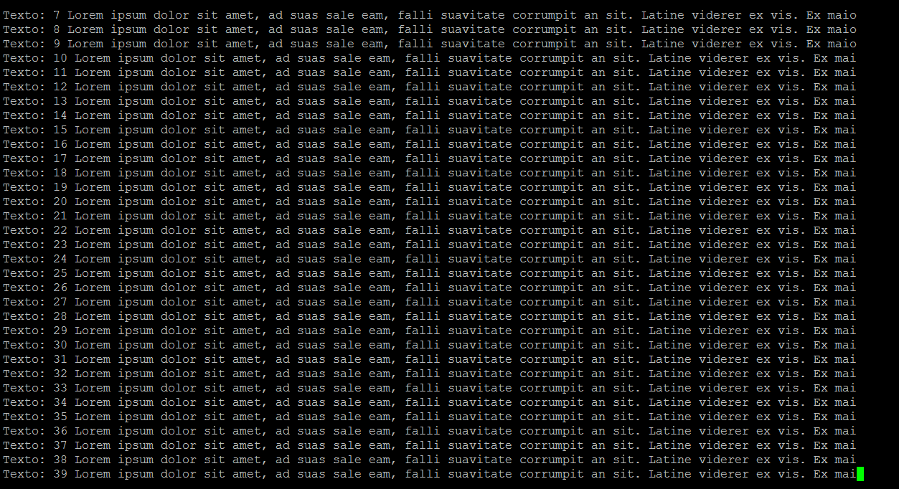
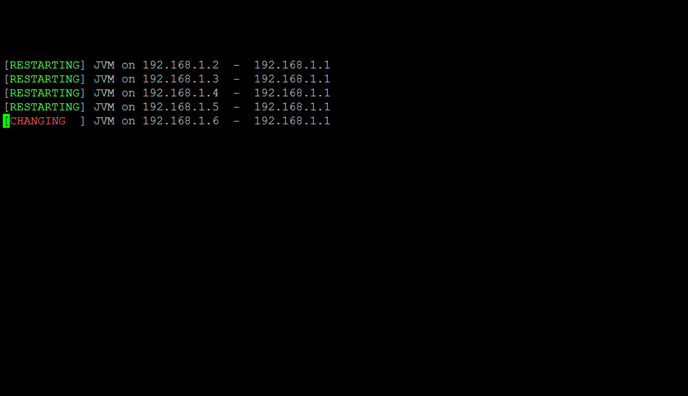
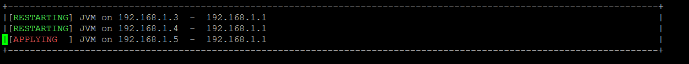

# Print Box

Class with functions to delimit a box on screen (With a border or not) and print strictly inside the created box, with scroll to the new lines.

## Getting Started

These instructions will get you a copy of the project up and running on your local machine for development and testing purposes. See deployment for notes on how to deploy the project on a live system.

### Prerequisites

Developed and tested in Linux Ubuntu and Python 2.7


### Installing

A step by step series of examples that tell you have to get a development env running

1. Create a folder called "box.py" inside the folder of your project.
2. Copy the box.py.py and `__init__.py` files to the box.py folder
3. Do class import for your project normally.

* If the import is successful, a file called box.py.pyc must be created, this file (compiled python file) must be maintained.

## Functions
### pyBox

pyBox(x, y, x2, y2, border=False, clear_screen=False):

Description: Create a instance of a box, with sizes, border and information if will perform a clear screen


**x**: Line of box beginning on screen
**y**: Column of box beginning on screen
**x2**: Line of box end on screen
**y2**: Column of box end on screen
**border**: Draw a border (will reduce 2 lines and 2 columns of useful box)
**clear_screen**: Clear screen before draw a box

Return: Box object

### box_clear

box_clear()

Description: Clear buffer. Necessary on new print calls

Return: None

### box_print

box_print(txt_String, new_Line=True):


Description: Print anything on a delimited box created by pyBox()

**txt_String**: Text to print (accept Text_Color contants)
**new_Line**: Print on new line (True) or over last line (False)
  
Return: None
              
## Deployment

Additional notes about how to deploy this on a live system:
Para deploy em ambiente de live:
1) Create a folder called "box" inside the folder of your project.
2) Copy the box.pyc and `__init__.pyc` files to the box folder

Note: Unless you really have experience, do not install directly on /usr/local/lib/python2.7/dist-packages

For next versions will be available installation by setup or pip.

## Examples of use

```
from time import sleep
import box
import os 
print "\033c"

obj_Box1 = box.pyBox(16, 1, 52, 120, False, False)        
obj_Box1.create_box()

for i in range(501):
    obj_Box1.box_print('Texto: ' + str(i) + ' Lorem ipsum dolor sit amet, ad suas sale eam, falli suavitate corrumpit an sit. Latine viderer ex vis. Ex maiorum fuisset aliquando vix, in cum dicant gloriatur. Ei elit argumentum cum, quod blandit an eum.')
    sleep(1) # Time in seconds.
    
```

[](Capture2.PNG)


```
import box
from text_color import text_color
from time import sleep
print "\033c"    

obj_Box1 = box.pyBox(16, 1, 20, 120, False, False)        
obj_Box1.create_box()

num_IP = dict()
num_IP['DC'] = 'dc-1'
num_IP['IP'] = '192.168.1.1'

for i in range(501):
    obj_Box1.box_print('[' + text_color.fg_Bright_Red + 'BACKUPING ' + text_color.text_reset + '] JVM on %s  -  %s \r' % ('192.168.1.' + str(i), num_IP['IP']),True)
    sleep(1) # Time in seconds.
    obj_Box1.box_print('[' + text_color.fg_Bright_Red + 'CHANGING  ' + text_color.text_reset + '] JVM on %s  -  %s \r' % ('192.168.1.' + str(i), num_IP['IP']),False)
    sleep(1) # Time in seconds.
    obj_Box1.box_print('[' + text_color.fg_Bright_Red + 'APPLYING  ' + text_color.text_reset + '] JVM on %s  -  %s \r' % ('192.168.1.' + str(i), num_IP['IP']),False)
    sleep(1) # Time in seconds.
    obj_Box1.box_print('[' + text_color.fg_Bright_Green + 'RESTARTING' + text_color.text_reset + '] JVM on %s  -  %s \r' % ('192.168.1.' + str(i), num_IP['IP']),False)
    sleep(1) # Time in seconds.
     
```
[](Capture.PNG)

```
import box
from text_color import text_color
from time import sleep
print "\033c"    

obj_Box1 = box.pyBox(16, 1, 20, 120, True, False)        
obj_Box1.create_box()

num_IP = dict()
num_IP['DC'] = 'dc-1'
num_IP['IP'] = '192.168.1.1'

for i in range(501):
    obj_Box1.box_print('[' + text_color.fg_Bright_Red + 'BACKUPING ' + text_color.text_reset + '] JVM on %s  -  %s \r' % ('192.168.1.' + str(i), num_IP['IP']),True)
    sleep(1) # Time in seconds.
    obj_Box1.box_print('[' + text_color.fg_Bright_Red + 'CHANGING  ' + text_color.text_reset + '] JVM on %s  -  %s \r' % ('192.168.1.' + str(i), num_IP['IP']),False)
    sleep(1) # Time in seconds.
    obj_Box1.box_print('[' + text_color.fg_Bright_Red + 'APPLYING  ' + text_color.text_reset + '] JVM on %s  -  %s \r' % ('192.168.1.' + str(i), num_IP['IP']),False)
    sleep(1) # Time in seconds.
    obj_Box1.box_print('[' + text_color.fg_Bright_Green + 'RESTARTING' + text_color.text_reset + '] JVM on %s  -  %s \r' % ('192.168.1.' + str(i), num_IP['IP']),False)
    sleep(1) # Time in seconds.
     
```

[](Capture3.PNG)

## Versioning
```
=======================================================================================
== Log Changes:
== Date:            2018-04-03
== Author:          Fausto Branco
== Version:         1.0.0
== Description:     Initial Version
=======================================================================================
```
## Authors
```
=======================================================================================
== Script Info:		box.py - Class with functions to create a virtual box on screen and print on then
==
=======================================================================================
== Create Author:	Fausto Branco
== Create Date:		2018-04-03
== Actual Version:  1.0.0
== Description:		
=======================================================================================
== Log Changes:
== Date:            2018-04-03
== Author:          Fausto Branco
== Version:         1.0.0
== Description:     Initial Version
=======================================================================================
```
## License


